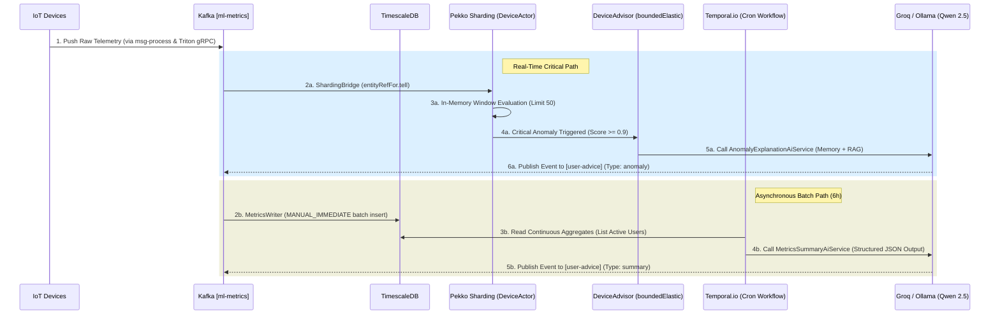

# IoT Real-Time Telemetry Aggregator & GenAI Analytics Platform

An enterprise-grade, high-throughput IoT streaming ecosystem engineered with a **Lambda-Inspired Hybrid Path (Real-Time + Batch)** paradigm, **Stateful Stream Processing**, and **Structured LLM Orchestration**. Designed specifically for high-volume IoT networks and industrial monitoring platforms where device telemetry flows continuously, demanding sub-millisecond edge anomaly detection alongside deep, context-aware LLM batch report generation.

---

## System Architecture Overview

The platform is architected around a unified reactive pipeline that splits incoming data into two completely isolated processing execution bounds: a low-latency, stateful real-time scoring pathway and an asynchronous, heavily retriable batch analytics engine.



### 1. Inbound Streaming & Storage Layer
* **Core Tech:** Spring Cloud Stream, Kafka, Pure Spring JDBC (`JdbcTemplate`), HikariCP, TimescaleDB.
* **Responsibility:** Operates as the high-throughput entry point. Telemetry is pre-scored by a Triton ML instance via gRPC and pushed to Kafka. The `MetricsWriter` uses an optimized **`MANUAL_IMMEDIATE` acknowledgement batch mode** to flush events in bulk, ensuring a single database round-trip per batch and guaranteeing strict **At-least-once delivery**.

### 2. Stateful Real-Time Scoring (Pekko Cluster Sharding)
* **Core Tech:** Apache Pekko Typed, Jackson-CBOR Serialization, Project Reactor.
* **Responsibility:** Retains a hot sliding window of the last **50 events** per device completely in-memory. Upon startup or node recovery, states are reconstructed seamlessly via a reactive database cold-start. Decisions are computed instantly: any single validation score `≥ 0.9` or sustained upward trend triggers an immediate non-blocking call to the `DeviceAdvisor`.

### 3. Orchestrated Batch Analytics (Temporal.io)
* **Core Tech:** Temporal.io SDK, Spring WebFlux, Redis Sentinel (`KeyValueRepository`), Virtual Threads.
* **Responsibility:** A failure-immune batch pipeline executed every **6 hours**. Managed by a `ReportFanOutWorkflow`, it divides tasks dynamically per user. If the external AI provider fluctuates, Temporal handles exponential backoff and retries safely over multiple worker restarts, entirely preventing task failure.

---

## Key Engineering Patterns

### Extensible AI Processor Strategy Sandbox
To eliminate vendor lock-in and simplify testing, the LLM boundary is decoupled using a polymorphic Strategy Pattern managed by an LlmProcessorFactory. The system natively integrates Qwen 2.5 (via OpenAI-compatible Groq Cloud API or locally via Ollama). Switching frameworks, executing token limits via local char heuristics, or running mock environments requires only an environment profile adjustment.

### Vector-Backed RAG Injection & Token Trimming Memory
Real-time anomaly evaluation is powered by conversational state tracking and Retrieval-Augmented Generation (RAG).
* The system utilizes a dynamically scaled TokenWindowChatMemory mapped to the active model's footprint to clip history boundaries and eliminate context window explosions.
* The ContentRetriever vector backend automatically injects localized troubleshooting instructions and manuals based on the exact deviceModel string, turning raw numbers into actionable user advice.

### Hybrid Request Processing (Scheduled vs Reactive On-Demand)
The 6-hour reporting routines can be executed periodically or explicitly on-demand by end-users. An ad-hoc request hits a reactive Spring WebFlux endpoint, which invokes a completely non-blocking Project Reactor pipeline running on isolated boundedElastic worker threads. The outbound UserAdviceEvent carries a descriptive triggerKind ("scheduled" vs "on-demand") ensuring downstream notification services route push-alerts correctly.

---

## Getting Started

### Prerequisites
* JDK 21 or higher
* Apache Maven 3.9+
* Docker & Docker Compose v2.0+

### Configuration Setup
Configure your data sources, reactive bindings, and the targeted Qwen model properties inside `src/main/resources/application.yml`:

### Infrastructure Provisioning
Spin up the isolated system databases and the background Temporal orchestration engine using the repository manifest:
```bash
docker compose up -d
```

### Build and Test Lifecycle
Verify reactive stream routing and pass comprehensive unit tests across the cluster stack:
```bash
mvn clean test package
```