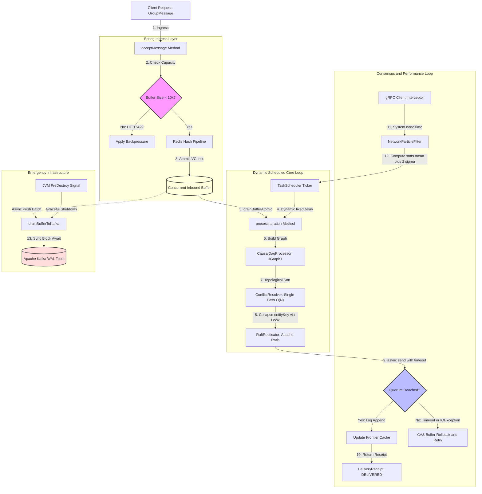

# SOA-ESPS Coordinator Microservice

A high-performance distributed message coordinator that ensures **Causal Consistency** and guarantees **Zero Data Loss** in geographically distributed topologies (Multi-Data Center).

The service acts as the core of distributed consensus, combining mathematical graph ordering with dynamic adaptation to physical network anomalies.

---

## Architecture and Technology Stack

The microservice is designed around the concept of **Hybrid Logical-Physical Consensus**:

1. **Consensus and Log Replication:** [Apache Ratis](https://ratis.apache.org) (an industrial-grade Java implementation of the Raft protocol). Ensures strict `Total Ordering`, quorum reliability, and protection against network partitions (`Split-Brain`).
2. **Causal Ordering (Causal Graph):** [JGraphT](https://jgrapht.org). Used to build an in-memory `DirectedAcyclicGraph` on the Leader node to linearize parallel chat branches.
3. **Adaptive Timeouts (Network Layer):** A custom Monte Carlo **Particle Filter**, adapted from the scientific research of A.S. Viktorov (VINITI RAS). It estimates network jitter and RTT via gRPC interceptors, dynamically adjusting scheduler windows and Raft RPC timeouts.
4. **Vector Clock Storage:** [Redis Hashes](https://redis.io) utilizing `executePipelined` for lock-free, atomic incrementing of distributed vector clocks.
5. **Write-Ahead Log (WAL) Ingress:** [Apache Kafka](https://kafka.apache.org). Used as a resilient distributed disk log for emergency transaction flushing during graceful shutdowns.

---

## Data Flow Lifecycle

The diagram below illustrates the architectural layers and the message path from ingress to achieving distributed Raft quorum:



---

## Core Components Structure

* **`domain.GroupMessage`**: An immutable Java Record equipped with Lombok `@Builder` and `@Jacksonized` annotations. Contains vector clocks, iteration markers, and a `parentIds` array for DAG reconstruction.
* **`dag.CausalDagProcessor`**: Interface and JGraphT implementation that performs batch topological sorting and tracks sliding consistency state via an O(1) `Frontier Cache` using reverse indexes.
* **`component.ConflictResolver`**: A highly efficient single-pass component that resolves concurrent update collisions on the same resource (`entityKey`) in O(N) linear time without redundant memory allocations, utilizing direct `HashMap` operations.
* **`algorithm.NetworkParticleFilter`**: A thread-safe (CAS-based Lock-free) particle filter with built-in Effective Sample Size (`ESS Threshold`) calculation and automatic caching of computed statistics (`mean`, `stdDev`) to guarantee O(1) read time.
* **`infrastructure.grpc.RttMeasuringClientInterceptor`**: A thread-safe gRPC interceptor that isolates call timestamps at the stack level (`Context Isolated`) to accurately feed physical RTT data into the particle filter.
* **`raft.RaftLeaderCoordinator`**: The central Spring component orchestrating batch commit phases, managing backpressure (`MAX_BUFFER_SIZE = 10_000`), and ensuring scheduler liveness guarantees through comprehensive fault tolerance (`catch Throwable`).

---

## Infrastructure Configuration (`application.yml`)

The following baseline settings are required to deploy the microservice in a Multi-DC environment:

```yaml
spring:
  application:
    name: soaesps-coordinator
  
  # Integration with Kafka WAL for emergency buffer flushing
  kafka:
    bootstrap-servers: kafka-cluster.soaesps.internal:9092
    producer:
      acks: all
      key-serializer: org.apache.kafka.common.serialization.StringSerializer
      value-serializer: org.springframework.kafka.support.serializer.JsonSerializer
      properties:
        enable.idempotence: true

  # Distributed vector clock synchronization
  data:
    redis:
      host: redis-master.soaesps.internal
      port: 6379
      lettuce:
        pool:
          max-active: 64

# Security settings for inter-server gRPC replication transport
grpc:
  security:
    enabled: true
    trust-cert-collection-file-path: /var/private/ssl/ca.crt
    client-cert-chain-file-path: /var/private/ssl/coordinator.crt
    client-private-key-file-path: /var/private/ssl/coordinator.key

# Replication pipeline performance monitoring in Grafana
management:
  endpoints:
    web:
      exposure:
        include: prometheus,health,info
```

---

## Build and Run

### Prerequisites
* Java 17 or higher
* Apache Maven 3.8.x+
* Running instances of Kafka and Redis

### Project Compilation
To generate Protobuf classes and compile the source code, run the following command in the module root:
```bash
mvn clean install
```

### Running in Leader Profile
```bash
java -jar target/coordinator-1.0.0.jar --spring.profiles.active=prod
```

---

## Security and Fault Tolerance Measures

1. **Backpressure Throttling:** When the inbound Concurrent buffer limit of `10,000` messages is reached, the service instantly throws an `IllegalStateException`, forcing the API Gateway to drop the load (HTTP 429), thereby protecting the JVM from OutOfMemory errors.
2. **Resilience Block:** Any error during batch processing is intercepted via `catch (Throwable)`, preventing the main `TaskScheduler` thread from crashing, while the drained batch is atomically returned to the queue for retry.
3. **DoS Protection:** The `GroupMessage` constructor enforces a strict limit on the size of incoming vector clocks (maximum 1024 nodes), effectively blocking "State Bloating" attacks.