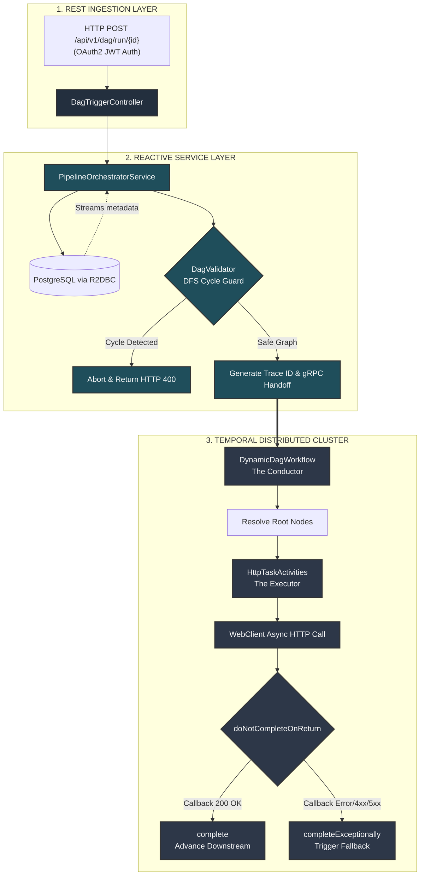

# JetDAG Service

JetDAG Service is a high-performance, fully reactive microservice orchestrator designed to compose, validate, and execute dynamic **Directed Acyclic Graphs (DAG)** of tasks. Built on top of **Spring Boot 3 (WebFlux)** and **Temporal.io**, it provides a non-blocking framework to manage distributed workflows with complex topologies, automated error retries, and transactional fallback paths.

---

## Architecture & Request Lifecycle

The system utilizes an asynchronous handoff pattern, splitting responsibility between a reactive REST/DB ingest layer and an event-driven Temporal orchestrator cluster.



---

## Tech Stack

* **Language Runtime:** Java 21+ LTS (or Java 24)
* **Core Framework:** Spring Boot 3.x, Spring WebFlux (Reactive Streams)
* **Security:** Spring Security OAuth2 Resource Server (JWT verification)
* **Orchestration Engine:** Temporal.io Java SDK
* **Database Layer:** Spring Data R2DBC (PostgreSQL asynchronous driver)
* **Utilities:** Project Lombok, Jackson ObjectMapper
* **Containerization:** Docker (Alpine Minimal Footprint Base Layer)

---

## Getting Started

### Prerequisites
* **JDK 21** or **JDK 24** installed locally
* **Docker** & **Docker Compose**
* Access to a running **Temporal Cluster** (`localhost:7233`) and a **PostgreSQL** database.

### Building the Container
To compile the application and packages natively within a standardized environment, run:
```bash
docker build -t jetdag-service:latest .
```

---

## API Reference

### Trigger DAG Execution

* **URL:** `/api/v1/dag/run/{pipelineId}`
* **Method:** `POST`
* **Headers:** `Authorization: Bearer <JWT_TOKEN>`
* **Path Parameters:** `pipelineId` (UUID) - The unique configuration key of the target pipeline.

#### Response: `200 OK`
```json
{
  "status": "TRIGGERED",
  "message": "DAG configuration loaded from DB and handed off to Temporal successfully",
  "temporal_workflow_id": "dag-Data_Sync_Pipeline-a1b2c3d4"
}
```

#### Response: `400 Bad Request` (Cycle Found)
```json
{
  "error": "Critical architectural violation: Circular dependency (infinite loop) detected in pipeline [Data_Sync_Pipeline]!"
}
```

---

## Structural Reliability & Fallbacks

1. **Cycle Guard:** The `DagValidator` engine runs a **Three-State Depth-First Search (DFS)** algorithm (`0=UNVISITED`, `1=VISITING`, `2=COMPLETED`). It acts as an immutable structural safeguard, detecting any back-edges or self-referential infinite loops in database configurations prior to workflow execution.
2. **Asynchronous Web Hooks:** Activities leverage `context.doNotCompleteOnReturn()`. This releases all underlying worker threads while waiting for long-running downstream REST service endpoints to reply, providing supreme memory efficiency.
3. **Database Fallbacks:** When a task node fails network retries, the orchestrator inspects the relational definition. If a valid `fallbackTaskCode` parameter is provided, it dynamically hot-swaps execution threads into a contingency recovery loop.