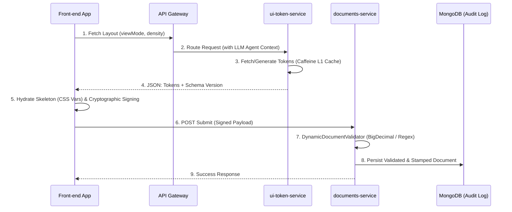

# Agentic UI & Dynamic Document Validation Platform

An enterprise-grade, high-throughput financial ecosystem engineered with a **Server-Driven UI (SDUI)** paradigm and **Strict Temporal Auditability**. Designed specifically for high-volume crypto exchanges and institutional OTC platforms where legal and compliance agreements (e.g., Collateral Pledges, Risk Disclosures, Term Sheets) mutate continuously based on jurisdictions, user intent, and underlying financial assets.

---

## System Architecture Overview

The platform is split into two completely isolated microservices to ensure strict separation of concerns, fault isolation, and sub-millisecond execution paths under heavy loads.



### 1. ui-token-service (Presentation Layer)
* **Core Tech:** Java 17, Spring WebFlux, Netty, Spring Data Reactive MongoDB, Caffeine Cache.
* **Responsibility:** Operates on the absolute edge. Intercepts explicit user layout requests (e.g., `viewMode=EXPERT`, `density=COMPACT`) and leverages an LLM context manager to compile a lightweight JSON package carrying atomic **Design Tokens** (colors, typography constants, margins).
* **Performance:** Completely non-blocking Event Loop architecture. Delivers layout configurations from an in-memory Caffeine cache in less than 1ms, entirely bypassing CPU-heavy HTML template compilation.

### 2. documents-service (Core Validation & Execution Layer)
* **Core Tech:** Java 17, Spring WebFlux, Netty, Reactive MongoDB.
* **Responsibility:** The secure, immutable source of truth. It handles document state persistence, transactional crypto-signing pipelines, and multi-type runtime data validation. It isolates the platform's core boundaries from presentation layer failures.

---

## Key Engineering Patterns

### Pure JSON Design Tokens Sandbox (Zero-XSS / Zero-CSS Injection)
To eliminate severe security hazards like UI Redressing or malicious CSS attribute selectors (used for logging input keys), the LLM agent is strictly sandboxed. The AI model **never generates raw HTML, scripts, or stylesheet strings**. It outputs structured design-token metadata metrics that the immutable frontend application maps directly onto localized CSS Custom Properties (CSS variables) inside a secure form scaffold.

### Strict Schema Versioning & Temporal Auditability
Legal document frameworks are bound to strict chronological validity states to meet global compliance criteria.
* Every transaction captures and immutably stamps the exact `schema_version` used during validation loop execution into the document's core metadata block.
* Months or years later, auditors can feed this historical token layout framework back into the frontend renderer to achieve a **pixel-perfect reconstruction** of the exact screen matrix the institutional investor saw at the execution timestamp.

### Elite Numeric Precision (BigDecimal Normalization)
To comply with global fintech standards and mitigate hazardous floating-point or scale errors during range boundary validation checks, the underlying `DynamicDocumentValidator` automatically normalizes all runtime numerical primitives (e.g., standard JSON integers, doubles, Decimal128) into **`java.math.BigDecimal`** instances, validating numeric limits exclusively via non-blocking `.compareTo()` pipelines.

---

## Getting Started

### Prerequisites
* JDK 17 or higher
* Apache Maven 3.8+
* MongoDB v6.0+ (Running with replica set enabled for reactive Change Streams support)

### Configuration Setup
Configure your cache bounds and reactive infrastructure properties within `ui-token-service/src/main/resources/application.yml`:

```yaml
server:
  port: 8085

spring:
  application:
    name: ui-token-service
  data:
    mongodb:
      uri: mongodb://localhost:27017/nukefintech_ui

notification:
  cache:
    caffeine:
      spec: initialCapacity=100,maximumSize=5000,expireAfterWrite=15m
```

### Build and Compilation
Compile the reactive multi-module ecosystem using the root directory wrapper:
```bash
mvn clean compile package
```

---

## Acknowledgments

Special thanks to the architectural community for their production-grade code reviews and design iterations:
* **Holger Woltersdorf ([@holger-woltersdorf](https://github.com))** – For validating the Server-Driven UI (SDUI) tokenization pipeline and outlining event-sourced layout metadata preservation methodologies.